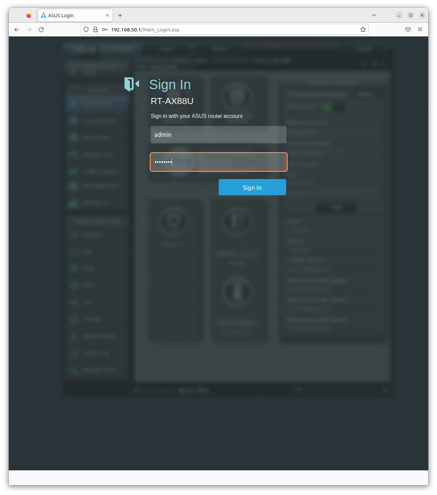
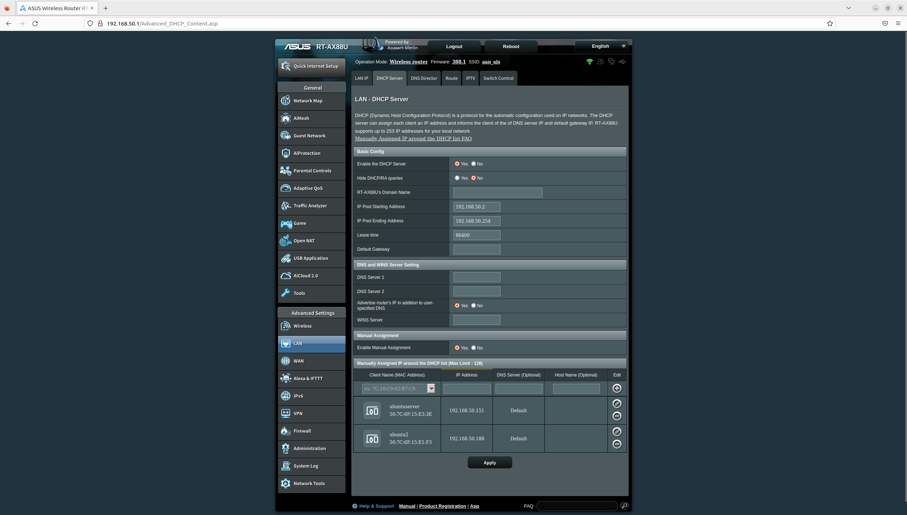
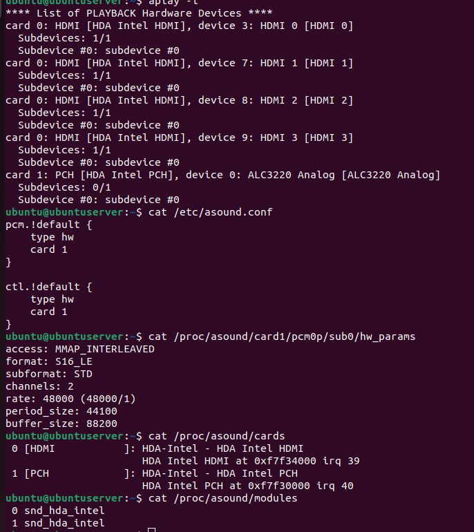
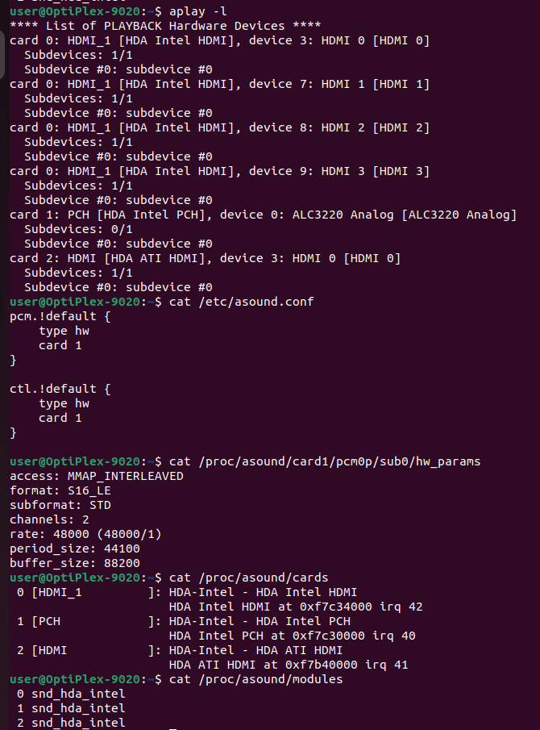
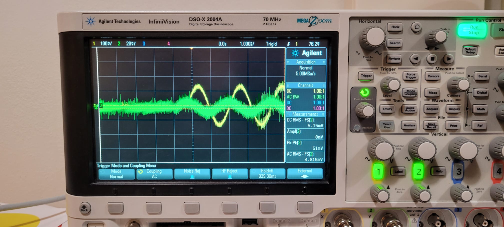
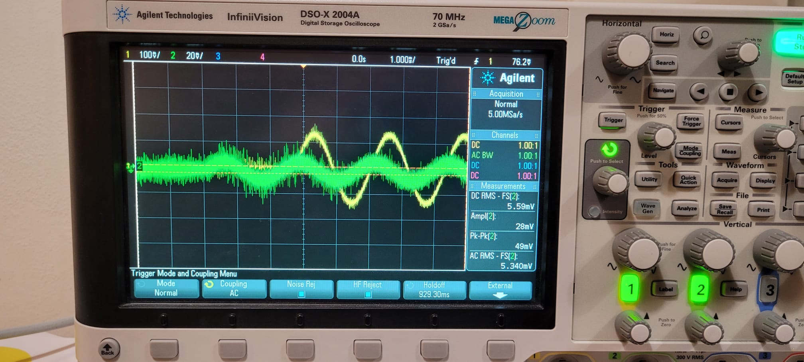
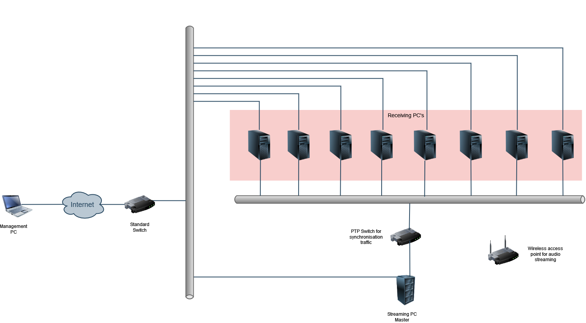

# AAU

# AAU_Audio_Sync

# Prerequisites
This repository assumes that you are using ubuntu 22


# Repository Structure
```bash
.
└── src #Source code for all files
    ├── interface.cfg #Stores the interface variable
    ├── config_scripts #Scripts to configure the device
    │   └── interface_config.sh #binds an interface to an ip address
    ├── gstreamer #Sample scripts to create a synchronized media stream
    │   ├── gstreamer_master.sh #configures the master device stream
    │   ├── greamer_slave_1.sh #configures the local device as slave
    │   └── greamer_slave_2.sh #configures a remote device as a slave 
    ├── install_scripts #Scripts to install the appropriate software 
    │   ├── asound.conf #configuration file for audio config
    │   ├── gstreamer_install.sh #install the latest version of gstreamer
    │   └── linuxptp_install.sh #installs the lates version of linuxptp
    └── ptp #scripts to configure synchronisation
        ├── config_files #Directory containing the options for ptp
        │   ├── phc2sys.cfg
        │   ├── ptp4l_master.cfg
        │   └── ptp4l_slave.cfg
        ├── phc2sys_launch.sh #Synchronizes the sys clock to the ptp clock
        ├── ptp4l_master_launch.sh #Starts ptp as a master
        └── ptp4l_slave_launch.sh #Starts ptp as a slave

```

## Reports

```
Here you can find project reports
1.) Synchronizing Time with Linux PTP.docx
2.) Wireless streaming with cabled clock sychronization
3.) Tests implementing synchronization on gstreamer
```


## Installation
To install linuxptp execute:
```
sudo ./src/install_scripts/linux_ptp.sh
```

similarly, for gstreamer run:
```
sudo ./src/install_scripts/gstreamer_install.sh
```
If there are issues with audio streaming, it may be necessary to copy the configuration found in:
```
/src/install_scripts/asound.conf
```
to
```
/etc/asound.conf 
```

## Configuration
Following installation of the required software packages, ip addresses and interfaces must be configured.

### Interface config
The PTP scripts need to know which networking interface to target. This is configured by setting the interface variable in:
```
/src/interface.cfg
```

The list of interfaces can be found using:
```
ifconfig
```

### IP Config
I recommend that you configure a static ip address for the PTP ethernet interfaces in your routers DHCP configuration. To do this in your RT-AX88U router you must first login. By the time of writing, the default gateway is 192.168.50.1 and the credentials are:
```
username: admin
password: Pass1234
```

To set static ip's for the connected devices navigate to LAN->DHCP Server->Manually assign IP


In case you do not wish to use router defined static ip's you can directly alter the interface ip address using the script:
```
/src/config_scripts/interface_config.sh
```
Before executing it, remember to modify the file's desired ip address 

## PTP Setup
To run PTP first launch the master device using:

### Master
```
sudo ./ptp4l_master_launch.sh
```
and synchronize the system clock of the master device to the ptp clock:
```
sudo ./phc2sys_launch.sh
```

### Slave
To start the slave device, first make sure the `UDPv4` ip address set in `/src/ptp/config_files/ptp4l_slave.cfg` matches the ip of the master device.

Next start the slave device using:
```
sudo ./ptp4l_slave_launch.sh
```

and synchronize the system clock of the slave device to the ptp clock:
```
sudo ./phc2sys_launch.sh
```

## Gstreamer Setup
Streaming using gstreamer should only be started after ptp synchronization is complete.

First, start the gstreamer slave devices. The slave located on the same physical system as the master device is started with:
```
sudo ./gstreamer_slave_1.sh
```
To start another slave on a remote device run the second script:
```
sudo ./gstreamer_slave_2.sh
```

After both slaves have been started you can start the master script:

```
sudo ./gstreamer_master.sh
```

In case of issues, check to make sure that the ip addresses in `gstreamer_slave_2.sh` and `gstreamer_master.sh` match the network configuration of the actual devices.

## Gstreamer Setup using UDP file transfer


Launch the gstreamer slave device.
```
sudo ./receiver_udp.sh
```

Now, time for launching gstreamer from master device.
```
sudo ./sender_udp.sh
```
## Audio Config

To check the audio settings and configurations on both systems, follow these steps:

Check the audio card specifications: You can use the aplay -l command to view a list of available sound cards and their specifications.

```
aplay -l 

```


Verify the ALSA configuration: The Advanced Linux Sound Architecture (ALSA) configuration can be found in the file /etc/asound.conf. You can compare the ALSA configuration of both systems to make sure they are the same.

```
cat /etc/asound.conf

```


Check the audio sample rate: The sample rate can be checked by running the cat /proc/asound/card0/pcm0p/sub0/hw_params command on each system. Make sure both systems have the same sample rate.


```
cat /proc/asound/card0/pcm0p/sub0/hw_params 

```

Verify the number of channels: Use the cat /proc/asound/card0/pcm0p/sub0/hw_params command to check the number of channels on each system. Make sure they are the same.

```
cat /proc/asound/card0/pcm0p/sub0/hw_params

```


Compare audio drivers: Check if both systems are using the same audio drivers by running the lsmod command and comparing the output.

Verify audio system settings: Check the audio settings in the sound settings of your operating system to make sure that both systems have the same settings.

To verify audio system settings in Linux, you can follow these steps:

Check the audio device:
Use the command "aplay -l" to list all the audio devices available in your system.

```
aplay -l

```
Check the current configuration:
Use the command "cat /proc/asound/cards" to view the configuration of the audio devices.

```
cat /proc/asound/cards

```

Check the ALSA driver information:
Use the command "cat /proc/asound/modules" to view the ALSA driver information.

```
cat /proc/asound/modules

```


Check the audio system settings:
You can also check the settings of the audio system in the configuration file "/etc/asound.conf".

```
cat /etc/asound.conf

```


# PC 1 Audio config output


# PC 2 Audio config output



## Results
Using the method descripted above to synchronize two PC's using I210 NIC connected through an AX88U router, time synchronisation in the order of 10s of nanoseconds was achieved.

To compare the delay between two gstreamer audio streams the audio output of the devices can be connected to an oscilloscope and compared. Initially when gstreamer is first started on the devices, we see synchronisation in the order of 100's of us:


however over the next couple of minutes the time shift between the two streams increase to a couple of milliseconds:


The reason for this desynchronisation is not known to me, though I suspect it has something to do with the gstreamer configuration.

# Future network setup
For your final setup I recommend that you split your traffic into three types across three distinct hardware interfaces:

1. Ethernet connection to AAU networking. To allow the devices the abillity to receive updates from the internet and for the remote management.
2. Ethernet based PTP synchronisation. To provide optimal results, this may require a specialised switch with build in support for PTP. However, initially I suggests you start by trying to use a cheap normal switch.
3. WIFI for audio streaming.

The proposed setup is shown below:


To allow for a more flexible setup, I recommend that the 8 receiving PC's have atleast one build in ethernet port (for the management network) and space for at least three PCIe expansion cards:

- I210 NIC for the PTP network
- A WIFI card for the audio streaming network
- A soundcard (I assume you don't wanna use the crappy output from the build in sound card?) 


## Installing Instructions for ISOBELSoftware from B&O code; streaming audio part

```
1. Go to IsobelSoftware
2. run "chmod +x *.sh"
3. run "sudo ./install.sh"
4. run "chmod -R +777 isobel"
5. run "./build.sh"

```


# 1. Find the IsobelTypeSystem.hpp in the src folder (…/src/modules/TypeSystem/IsobelTypeSystem/IsobelTypeSystem.hpp)
Changes the const variable to point to your folder
    const static inline std::string SOUNDZONE_FILE_FOLDER { “/home/user/Desktop/IsobelSoftware/isobel/data/" }; // folder name for data, user needs to search for the platform location
 
# 2. Changes the path on the config file for the data (…/data/Config.json)
In the Config.json file changes this variable to point to your folder containing the config data   
"SOUNDZONE_FILE_FOLDER": "/home/user/Desktop/IsobelSoftware/isobel/data/",   changes to  "SOUNDZONE_FILE_FOLDER": " your path to the data folder /isobel/data/"

After changing isobeltypestsystem.hpp and config.json file
```
Go to /isobel —> run  “ ./scripts/build_x86.sh”
```


Then: Verify run Time dependency:
```
run ./runSoundZoneDemo.sh

```


## Our first streaming code drop according to the release roadmap
 
 How to build and compile
     Unzip the isobel.zip file
     Dir into isobel root make sure you have the read/write right to the file folders
     You need to changes the path file path in the config files to point to your root dir data folder.
         "SOUNDZONE_FILE_FOLDER": "/home/klaus/isobel/data/" changes to your dir Changes this in
             WooferConfig.json
             SoundbarConfig.json
             GlobalControllerConfig.json
 
Now compile the code using this cmd

```
./scripts/build_x86.sh

``` 
Run the streaming roles

```
./StartGlobalController.sh  (this is the rtp streaming master)
        
```
This will start the streaming master how will stream to two rtp clients, please note the corresponding config are the GlobalControllerConfig.json file, in this file you need to change the the gst pipeline ip address to your IP config
"GST_SINK_PIPELINE_STRING": "appsrc name=appsrc  max-bytes=2400 ! audioconvert ! volume  name = vol ! queue max-size-bytes=1200 ! audioconvert ! rtpL16pay  mtu=2412 ! multiudpsink clients=127.0.0.1:12345,127.0.0.1:12346 sync=true ts-offset=-100", Here it’s just config to run on the same machine
 
Now run  (this is a rtp streaming client)
    
```
./StartWooferClient.sh
        
```
   
This will start a rtp streaming client just as your slave scripts does. Here once again the corresponding config files are the WooferConfig.json
 
For starting a second rtp client run (this is a rtp streaming client)

```
./StartSoundbarClient.sh

```
For starting a second rtp client run (this is a rtp streaming client)
this will start another rtp streaming client, and the corresponding config files are the SoundbarConfig.json.  for now this is the same as the woofer config file, but for B&O where will be difference role configurations for a woofer and the soundbar.  But on each remote machine simple copy and run the woofer config files.


## Details folder 

contains the images shows that when both NIC card connected during sych which means that when we connected ptp supported NIC for sych and also Desktop own NIC card connected to the AAU network,
ptp library version images and asus ip network images.

also contains txt_files that are represent of the phc and ptp4l clock images in order to plot the time forfrequency and samples


## 2PC_setup
```
here the test for 2pc setup for xxx.xxx.xx.20,21 IPs addresses

´´´
